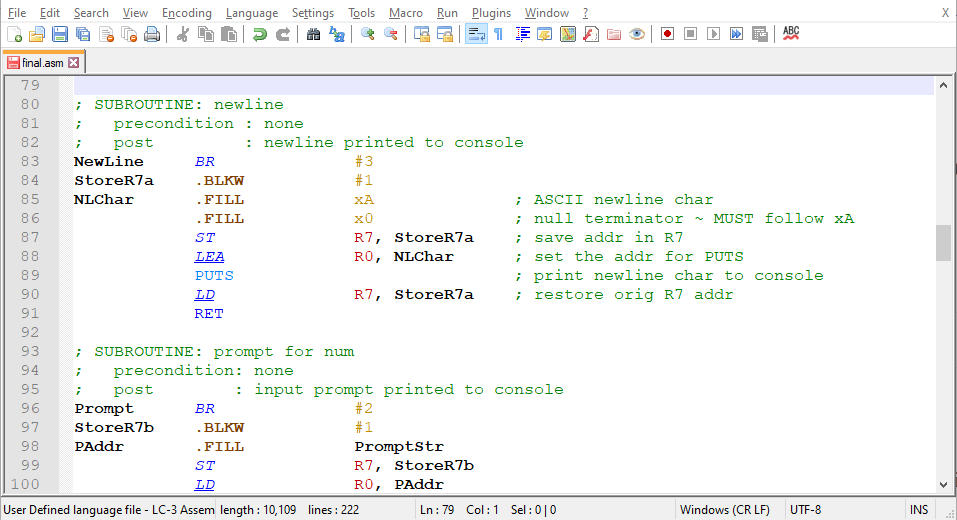
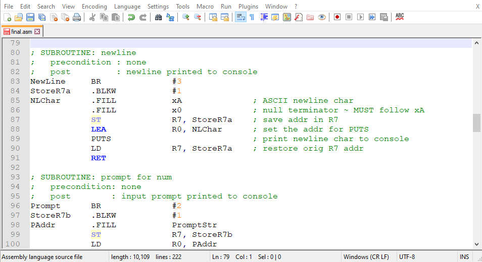
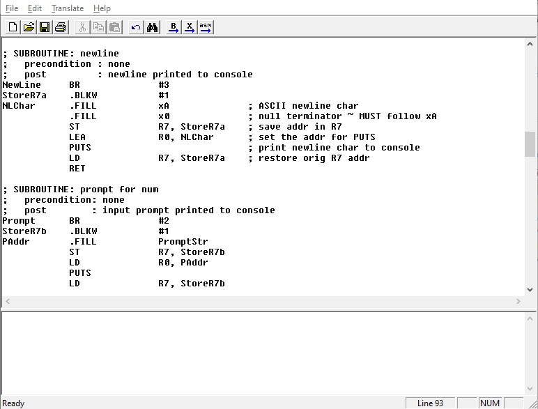

# LC3 on NPP (An LC-3 Simulator language file for Notepad++)
## About
This is a user-defined language file that can be loaded into Notepad++ to make
LC-3 assembly code easier to read, write, and understand. I put this together
while working through a computer organization course, and it helped me enough
that I thought I'd share. I wanted it to sort of mimic NPP's included assembly
style, so I've given it the following rules:
 * Instructions are blue.
   * Underlined instructions set the condition code.
   * Italicized instructions use a program counter offset.
   * Underlined and italicized instructions do both.
 * TRAP instructions are light blue.
 * Pseudo-ops are brown.
 * Registers are red.
 * Numbers (decimal, hex, and binary) are gold.
 * Comments are green.

## Screenshots
### Using Notepad++ with this language file

### Using Notepad++'s default settings

### Using LC3Edit

## Installation
 * Download the language file.
 * Open Notepad++.
 * Open the `Language` menu.
 * Click on the `Define your language...` submenu.
 * Click on the `Import` button near the top-left.
 * Select the downloaded file and click on the `Open` button.
 * Click the `OK` button when you see the "Import successful" pop-up.
 * Close and reopen Notepad++.

## Usage
 * Open or save a new .asm file.
 * Click on the `Language` menu.
 * Choose `LC-3 Assembly` at the bottom.

## Resources
[Notepad++ user-defined languages](https://npp-user-manual.org/docs/user-defined-language-system/)

[LC-3 Simulator download](https://highered.mheducation.com/sites/0072467509/student_view0/lc-3_simulator.html)